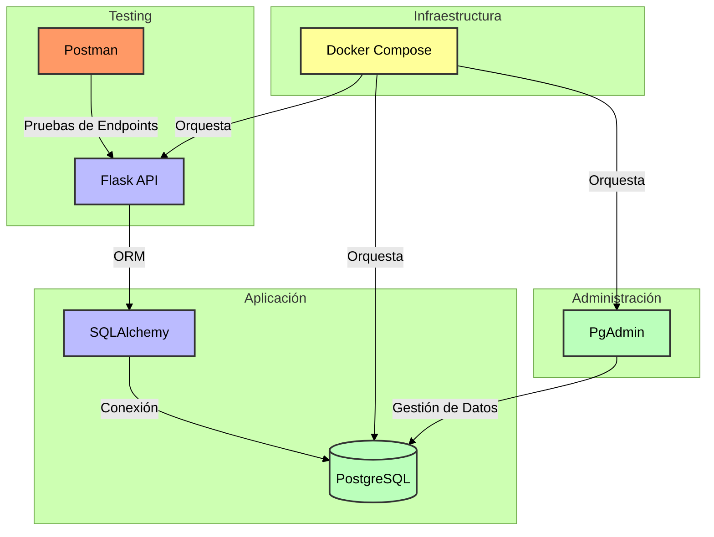

## Aplicación

- Implementación de sistema de registro de vehículos en condominio.
- Pruebas usando: [Requerimientos en Postman](Postman-Sistema-registro-condominio.json).


## Arquitectura de la Aplicación

Docker > Flask > SQLAlchemy > PostgreSQL > PgAdmin

```
- Contenedor: Docker
- BackEnd: Flask
- ORM: SQLAlchemy
- Base de datos: PostgreSQL
- Administración BD: PgAdmin
```

Docker-Compose construye y levanta 3 contenedores: Flask API, PostgreSQL y PgAdmin.



## Inicio y configuración

### Instalación

1. Instalar Docker-Compose:
```
https://docs.docker.com/compose/install/
```

2. Clonar el repo:
```
git clone https://github.com/malarau/sistemaregistrocondominio.git
```

3. Construir e iniciar (terminal o CMD en el mismo directorio):
```
docker-compose up --build
```

### URLs base

- Flask:
http://127.0.0.1:5000/

- PgAdmin:
http://localhost:8080/

- Postman (importar en app): [Requerimientos en Postman](Postman-Sistema-registro-condominio.json)


## Prueba de requerimientos

### Acceso

#### 1. Control de acceso al sistema

- Tipo: POST
- URL: http://127.0.0.1:5000/login
- Body: 

```JSON
{
    "usuario": "admin",
    "contrasena": "admin"
}
```

### Guardia

##### 2. Listar guardias

- Tipo: GET
- URL: http://127.0.0.1:5000/guardias/listar

##### 3. Añadir nuevo guardia

- Tipo: POST
- URL: http://127.0.0.1:5000/guardias/nuevo
- Body:

```JSON
{
    "usuario": "guardia2",
    "contrasena": "clave2",
    "rut": "98765432-1",
    "nombre_completo": "Guardia Dos"
}
```

##### 4. Editar guardia existente

- Tipo: PUT
- URL: http://127.0.0.1:5000/guardias/editar/12345678-9
- Body:

```JSON
{
    "nombre_completo": "Guardia Actualizado"
}
```

##### 5. Eliminar guardia

- Tipo: DELETE
- URL: http://127.0.0.1:5000/guardias/eliminar/98765432-1

### Departamento

##### 6. Listar departamentos

- Tipo: GET
- URL: http://127.0.0.1:5000/departamentos/listar

##### 7. Crear nuevo departamento

- Tipo: POST
- URL: http://127.0.0.1:5000/departamentos/nuevo
- Body:

```JSON
{
    "codigo_departamento": "D101",
    "numero_estacionamiento": 10
}
```

##### 8. Editar departamento existente

- Tipo: PUT
- URL: http://127.0.0.1:5000/departamentos/editar/D101
- Body:

```JSON
{
    "numero_estacionamiento": 15
}
```

##### 9. Eliminar departamento

- Tipo: DELETE
- URL: http://127.0.0.1:5000/departamentos/eliminar/D101

### Residente

##### 10. Listar Residentes

- Tipo: GET
- URL: http://127.0.0.1:5000/residentes/listar

##### 11. Crear nuevo residente

- Tipo: POST
- URL: http://127.0.0.1:5000/residentes/nuevo
- Body:

```JSON
{
    "rut": "333333333-3",
    "nombre_completo": "Residente 3",
    "departamento_id": "A200"
}
```

##### 12. Editar residente

- Tipo: PUT
- URL: http://127.0.0.1:5000/residentes/editar/33333333-3
- Body:

```JSON
{
    "nombre_completo": "Residente Actualizado"
}
```

##### 13. Eliminar residente

- Tipo: DELETE
- URL: http://127.0.0.1:5000/residentes/eliminar/33333333-3

### Vehículo

##### 14. Listar vehículos

- Tipo: GET
- URL: http://127.0.0.1:5000/vehiculos/listar

##### 15. Asignar nuevo vehículo

- Tipo: POST
- URL: http://127.0.0.1:5000/vehiculos/nuevo
- Body:

```JSON
{
    "patente": "PATENTE3",
    "departamento_id": "A100"
}
```

##### 16. Editar Vehículo

- Tipo: PUT
- URL: http://127.0.0.1:5000/vehiculos/editar/PATENTE3
- Body:

```JSON
{
    "departamento_id": "A200"
}
```

##### 17. Eliminar vehículo

- Tipo: DELETE
- URL: http://127.0.0.1:5000/vehiculos/eliminar/PATENTE3

### Registro de acceso

##### 18. Registrar actividad de ingreso

- Tipo: POST
- URL: http://127.0.0.1:5000/registro-actividad/ingreso
- Body:

```JSON
{
    "patente": "ABC123",
    "nombre_completo": "Visita Pérez Soto",
    "rut": "12345678-9",
    "departamento_id": "A100",
    "es_visita": true
}
```

##### 19. Registrar actividad de salida

- Tipo: PUT
- URL: http://127.0.0.1:5000/registro-actividad/salida/1

##### 20. Listar registros de actividad de ingreso

- Tipo: GET
- URL: http://127.0.0.1:5000/registro-actividad/listar